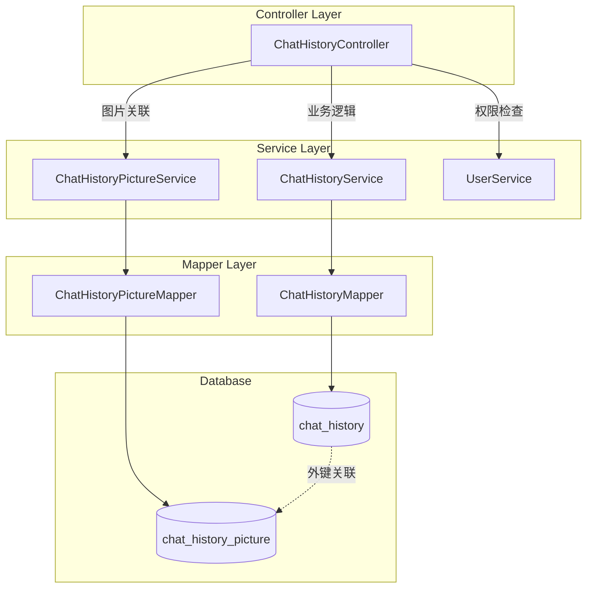
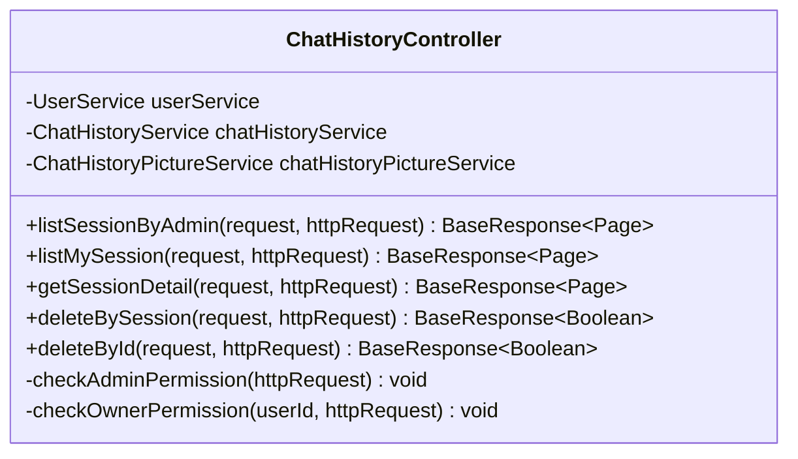
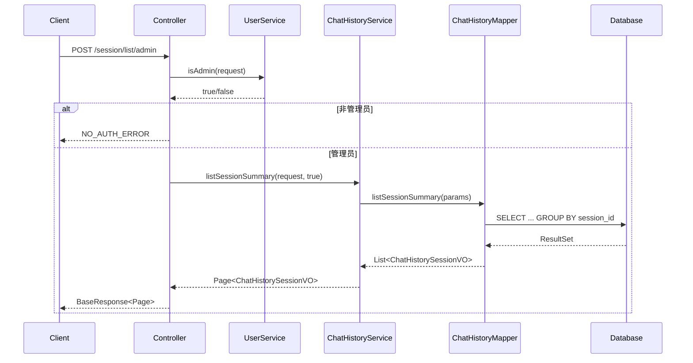
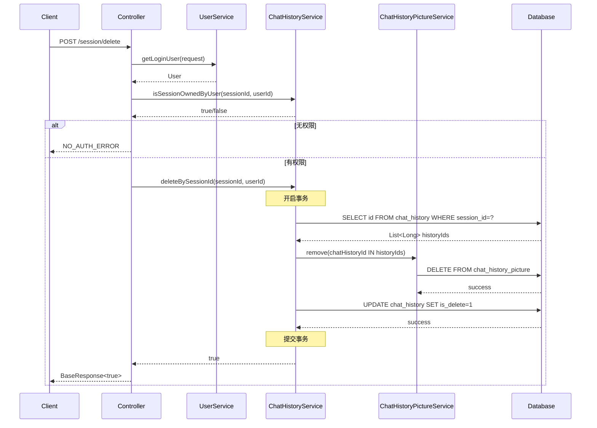
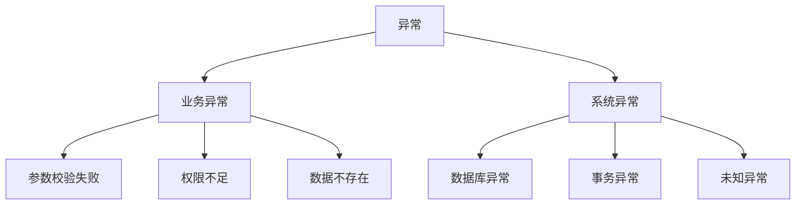

# DESIGN - ChatHistoryController 架构设计

## 1. 整体架构图



---

## 2. 核心组件设计

### 2.1 ChatHistoryController

**职责:**

- 接收 HTTP 请求
- 参数校验
- 权限控制
- 调用 Service 层
- 返回统一响应

**方法列表:**



### 2.2 ChatHistoryService (新增方法)

**新增接口方法:**

```java
public interface ChatHistoryService extends IService<ChatHistory> {
  
    /**
     * 分页查询 session 摘要列表
     * @param queryRequest 查询条件
     * @param includeUserId 是否包含 userId (管理员用)
     * @return session 摘要分页结果
     */
    Page<ChatHistorySessionVO> listSessionSummary(
        ChatHistorySessionQueryRequest queryRequest, 
        boolean includeUserId
    );
  
    /**
     * 分页查询 session 详情
     * @param queryRequest 查询条件
     * @return session 详情分页结果
     */
    Page<ChatHistoryDetailVO> listSessionDetail(
        ChatHistoryDetailQueryRequest queryRequest
    );
  
    /**
     * 根据 session_id 删除所有相关记录
     * @param sessionId session ID
     * @param userId 用户 ID (权限检查用)
     * @return 是否成功
     */
    boolean deleteBySessionId(Long sessionId, Long userId);
  
    /**
     * 根据 id 删除单条记录
     * @param id 记录 ID
     * @param userId 用户 ID (权限检查用)
     * @return 是否成功
     */
    boolean deleteByIdWithPermission(Long id, Long userId);
  
    /**
     * 检查 session 是否属于指定用户
     * @param sessionId session ID
     * @param userId 用户 ID
     * @return 是否属于
     */
    boolean isSessionOwnedByUser(Long sessionId, Long userId);
}
```

---

## 3. 数据流向图

### 3.1 查询 Session 列表流程



### 3.2 删除 Session 流程



---

## 4. 接口契约定义

### 4.1 API 1: 管理员查询 Session 列表

**请求:**

```http
POST /api/chat-history/session/list/admin
Content-Type: application/json

{
  "current": 1,
  "pageSize": 10,
  "sortField": "createTime",
  "sortOrder": "desc",
  "sessionId": 123456789,      // 可选
  "userId": 987654321,         // 可选
  "startTime": "2024-01-01T00:00:00",  // 可选
  "endTime": "2024-12-31T23:59:59"     // 可选
}
```

**响应:**

```json
{
  "code": 0,
  "data": {
    "records": [
      {
        "sessionId": 123456789,
        "firstChatTime": "2024-01-15T10:30:00",
        "firstPrompt": "生成一张风景图",
        "userId": 987654321
      }
    ],
    "total": 100,
    "current": 1,
    "size": 10
  },
  "message": "ok"
}
```

**权限:** 仅管理员

---

### 4.2 API 2: 用户查询自己的 Session 列表

**请求:**

```http
POST /api/chat-history/session/list/my
Content-Type: application/json

{
  "current": 1,
  "pageSize": 10,
  "sortField": "createTime",
  "sortOrder": "desc",
  "startTime": "2024-01-01T00:00:00",  // 可选
  "endTime": "2024-12-31T23:59:59"     // 可选
}
```

**响应:**

```json
{
  "code": 0,
  "data": {
    "records": [
      {
        "sessionId": 123456789,
        "firstChatTime": "2024-01-15T10:30:00",
        "firstPrompt": "生成一张风景图"
      }
    ],
    "total": 50,
    "current": 1,
    "size": 10
  },
  "message": "ok"
}
```

**权限:** 登录用户

---

### 4.3 API 3: 查询 Session 详情

**请求:**

```http
POST /api/chat-history/session/detail
Content-Type: application/json

{
  "sessionId": 123456789,      // 必填
  "current": 1,
  "pageSize": 20,
  "sortField": "createTime",
  "sortOrder": "asc",
  "messageType": "user",       // 可选: user/ai
  "startTime": "2024-01-01T00:00:00",  // 可选
  "endTime": "2024-12-31T23:59:59"     // 可选
}
```

**响应:**

```json
{
  "code": 0,
  "data": {
    "records": [
      {
        "id": 111111,
        "message": "生成一张风景图",
        "messageType": "user",
        "pictureId": 222222,
        "userId": 987654321,
        "sessionId": 123456789,
        "createTime": "2024-01-15T10:30:00",
        "pictures": [
          {
            "id": 333333,
            "chatHistoryId": 111111,
            "pictureId": 444444,
            "pictureType": "INPUT",
            "sortOrder": 1,
            "createTime": "2024-01-15T10:30:00"
          }
        ]
      },
      {
        "id": 111112,
        "message": "已为您生成图片",
        "messageType": "ai",
        "pictureId": 555555,
        "userId": 987654321,
        "sessionId": 123456789,
        "createTime": "2024-01-15T10:30:15",
        "pictures": [
          {
            "id": 333334,
            "chatHistoryId": 111112,
            "pictureId": 555555,
            "pictureType": "OUTPUT",
            "sortOrder": 1,
            "createTime": "2024-01-15T10:30:15"
          }
        ]
      }
    ],
    "total": 20,
    "current": 1,
    "size": 20
  },
  "message": "ok"
}
```

**权限:** 管理员 或 session 所有者

---

### 4.4 API 4: 删除 Session

**请求:**

```http
POST /api/chat-history/session/delete
Content-Type: application/json

{
  "sessionId": 123456789
}
```

**响应:**

```json
{
  "code": 0,
  "data": true,
  "message": "ok"
}
```

**权限:** 管理员 或 session 所有者

---

### 4.5 API 5: 删除单条记录

**请求:**

```http
POST /api/chat-history/delete
Content-Type: application/json

{
  "id": 111111
}
```

**响应:**

```json
{
  "code": 0,
  "data": true,
  "message": "ok"
}
```

**权限:** 管理员 或 记录所有者

---

## 5. 数据库设计

### 5.1 索引优化方案

**现有索引 (假设):**

- `PRIMARY KEY (id)`
- `INDEX idx_user_id (user_id)`

**新增索引:**

```sql
-- 优化 session 列表查询
ALTER TABLE chat_history 
ADD INDEX idx_session_user_time (session_id, user_id, create_time);

-- 优化时间范围查询
ALTER TABLE chat_history 
ADD INDEX idx_create_time (create_time);

-- 优化 messageType 过滤
ALTER TABLE chat_history 
ADD INDEX idx_message_type (message_type);
```

**索引选择理由:**

- `idx_session_user_time`: 覆盖 GROUP BY 和 ORDER BY,避免 filesort
- `idx_create_time`: 加速时间范围过滤
- `idx_message_type`: 加速子查询中的 `WHERE message_type = 'user'`

### 5.2 SQL 查询优化

#### 优化前 (慢查询):

```sql
SELECT 
    session_id,
    MIN(create_time) as first_chat_time,
    (SELECT message FROM chat_history 
     WHERE session_id = ch.session_id 
       AND message_type = 'user' 
     ORDER BY create_time ASC 
     LIMIT 1) as first_prompt,
    user_id
FROM chat_history ch
WHERE is_delete = 0
GROUP BY session_id, user_id
ORDER BY first_chat_time DESC;
```

**问题:** 子查询对每个 session 都执行一次

#### 优化后 (使用 JOIN):

```sql
SELECT 
    ch.session_id,
    MIN(ch.create_time) as first_chat_time,
    fp.message as first_prompt,
    ch.user_id
FROM chat_history ch
LEFT JOIN (
    SELECT 
        session_id,
        message,
        ROW_NUMBER() OVER (PARTITION BY session_id ORDER BY create_time ASC) as rn
    FROM chat_history
    WHERE is_delete = 0
) fp ON ch.session_id = fp.session_id AND fp.rn = 1
WHERE ch.is_delete = 0
GROUP BY ch.session_id, ch.user_id, fp.message
ORDER BY first_chat_time DESC;
```

**优化效果:**

- 子查询改为 JOIN,减少查询次数
- 使用窗口函数 `ROW_NUMBER()` 替代 LIMIT
  `<d>`这个只能给用户用，用户不需要主动排序，但是管理员需要 `</d>`

---

## 6. 异常处理策略

### 6.1 异常分类



### 6.2 异常处理代码

```java
@RestControllerAdvice
public class ChatHistoryExceptionHandler {
  
    @ExceptionHandler(BusinessException.class)
    public BaseResponse<?> handleBusinessException(BusinessException e) {
        log.error("Business exception: {}", e.getMessage());
        return ResultUtils.error(e.getCode(), e.getMessage());
    }
  
    @ExceptionHandler(DataAccessException.class)
    public BaseResponse<?> handleDataAccessException(DataAccessException e) {
        log.error("Database exception", e);
        return ResultUtils.error(ErrorCode.SYSTEM_ERROR, "数据库操作失败");
    }
  
    @ExceptionHandler(Exception.class)
    public BaseResponse<?> handleException(Exception e) {
        log.error("Unknown exception", e);
        return ResultUtils.error(ErrorCode.SYSTEM_ERROR, "系统错误");
    }
}
```

### 6.3 常见错误码

| 错误码 | 说明         | HTTP 状态码 |
| ------ | ------------ | ----------- |
| 40000  | 请求参数错误 | 400         |
| 40100  | 未登录       | 401         |
| 40300  | 无权限       | 403         |
| 40400  | 数据不存在   | 404         |
| 50000  | 系统错误     | 500         |

---

## 7. 性能优化方案

### 7.1 查询优化

**策略 1: 分页限制**

```java
// 限制最大分页大小
if (pageSize > 100) {
    pageSize = 100;
}
```

**策略 2: 查询字段优化**

```java
// 只查询必要字段,避免 SELECT *
.select(ChatHistory::getId, ChatHistory::getMessage, ...)
```

**策略 3: 批量查询**

```java
// 批量查询关联图片,避免 N+1 问题
List<Long> historyIds = ...;
List<ChatHistoryPicture> pictures = chatHistoryPictureService.list(
    new LambdaQueryWrapper<ChatHistoryPicture>()
        .in(ChatHistoryPicture::getChatHistoryId, historyIds)
);
```

### 7.2 缓存策略 (可选,后续优化)

```java
// 缓存 session 列表 (5分钟)
@Cacheable(value = "sessionList", key = "#userId + '_' + #current + '_' + #pageSize")
public Page<ChatHistorySessionVO> listMySession(Long userId, int current, int pageSize) {
    // ...
}

// 删除时清除缓存
@CacheEvict(value = "sessionList", allEntries = true)
public boolean deleteBySessionId(Long sessionId, Long userId) {
    // ...
}
```

---

## 8. 测试策略

### 8.1 单元测试

**测试用例:**

```java
@SpringBootTest
class ChatHistoryServiceTest {
  
    @Test
    void testListSessionSummary_AdminCanSeeAll() {
        // Given: 多个用户的 session
        // When: 管理员查询
        // Then: 返回所有用户的 session
    }
  
    @Test
    void testListSessionSummary_UserCanSeeOwn() {
        // Given: 多个用户的 session
        // When: 普通用户查询
        // Then: 只返回自己的 session
    }
  
    @Test
    void testDeleteBySessionId_CascadeDelete() {
        // Given: session 有多条记录和关联图片
        // When: 删除 session
        // Then: 所有记录和图片都被删除
    }
  
    @Test
    void testDeleteBySessionId_PermissionCheck() {
        // Given: 用户 A 的 session
        // When: 用户 B 尝试删除
        // Then: 抛出权限异常
    }
}
```

### 8.2 集成测试

**测试场景:**

```java
@SpringBootTest
@AutoConfigureMockMvc
class ChatHistoryControllerIntegrationTest {
  
    @Test
    void testFullWorkflow() {
        // 1. 创建测试数据
        // 2. 管理员查询 session 列表
        // 3. 用户查询自己的 session 列表
        // 4. 查询 session 详情
        // 5. 删除单条记录
        // 6. 删除整个 session
        // 7. 验证数据已删除
    }
}
```

---

## 9. 部署方案

### 9.1 数据库迁移

**步骤 1: 添加索引**

```sql
-- 在生产环境执行前,先在测试环境验证
ALTER TABLE chat_history 
ADD INDEX idx_session_user_time (session_id, user_id, create_time);

ALTER TABLE chat_history 
ADD INDEX idx_create_time (create_time);

ALTER TABLE chat_history 
ADD INDEX idx_message_type (message_type);
```

**步骤 2: 验证索引效果**

```sql
EXPLAIN SELECT 
    session_id,
    MIN(create_time) as first_chat_time,
    user_id
FROM chat_history
WHERE is_delete = 0
GROUP BY session_id, user_id;
```

### 9.2 灰度发布

**阶段 1: 只读接口 (低风险)**

- 先发布查询接口 (API 1, 2, 3)
- 观察 1-2 天,监控性能和错误率

**阶段 2: 写接口 (中风险)**

- 发布删除接口 (API 4, 5)
- 观察 1 周,确保无数据丢失

---

## 10. 监控指标

### 10.1 性能指标

- API 响应时间 (P50, P95, P99)
- 数据库查询时间
- 慢查询数量

### 10.2 业务指标

- 每日查询次数
- 每日删除次数
- 错误率

### 10.3 告警规则

- API 响应时间 P95 > 1s
- 错误率 > 1%
- 慢查询 > 10 次/分钟

---

## 11. 总结

### 11.1 核心设计原则

✅ **简洁性**: 5 个接口,职责清晰
✅ **复用性**: 权限检查逻辑复用
✅ **性能**: 索引优化 + 批量查询
✅ **安全性**: 严格的权限控制
✅ **可维护性**: 清晰的分层架构

### 11.2 关键技术点

- GROUP BY + 窗口函数优化查询
- 事务保证级联删除的原子性
- 批量查询避免 N+1 问题
- 索引优化提升查询性能

### 11.3 后续优化方向

- 引入 Redis 缓存热点数据
- 使用 Elasticsearch 支持全文搜索
- 异步删除大量数据
