# ChatHistoryController 开发文档总览

## 📋 文档导航

本次开发遵循 **6A 工作流**,已完成 **Align → Architect → Atomize** 三个阶段,生成以下文档:

| 文档               | 路径                                                                                                               | 说明                              |
| ------------------ | ------------------------------------------------------------------------------------------------------------------ | --------------------------------- |
| **需求对齐** | [ALIGNMENT_ChatHistoryController.md](file:///e:/workfile/yun-picture-backend/plan/ALIGNMENT_ChatHistoryController.md) | 需求分析、项目上下文、疑问澄清    |
| **技术共识** | [CONSENSUS_ChatHistoryController.md](file:///e:/workfile/yun-picture-backend/plan/CONSENSUS_ChatHistoryController.md) | 技术决策、API 设计、验收标准      |
| **架构设计** | [DESIGN_ChatHistoryController.md](file:///e:/workfile/yun-picture-backend/plan/DESIGN_ChatHistoryController.md)       | 系统架构、数据流、SQL 优化        |
| **任务拆分** | [TASK_ChatHistoryController.md](file:///e:/workfile/yun-picture-backend/plan/TASK_ChatHistoryController.md)           | 11 个原子任务、依赖关系、验收清单 |

---

## 🎯 核心需求

实现 **聊天历史管理功能**,包括:

1. ✅ **管理员查询所有 session 列表** (分页、过滤、排序)
2. ✅ **用户查询自己的 session 列表** (分页、过滤)
3. ✅ **查询 session 详情** (包括关联图片)
4. ✅ **删除整个 session** (级联删除)
5. ✅ **删除单条聊天记录** (级联删除)

---

## 🔑 关键技术决策

### 1. ChatHistoryPicture 使用逻辑删除 ⭐ 已更新

**理由:** 保持数据一致性,所有表统一使用逻辑删除

**数据库变更:**

```sql
ALTER TABLE chat_history_picture 
ADD COLUMN is_delete TINYINT DEFAULT 0 COMMENT '是否删除(0-未删除, 1-已删除)';
```

**实体类变更:**

```java
@TableLogic
@Schema(description = "是否删除(0-未删除, 1-已删除)")
private Integer isDelete;
```

### 2. 使用窗口函数优化查询

**SQL 优化:**

```sql
-- 使用 ROW_NUMBER() 替代子查询
SELECT session_id, MIN(create_time), fp.message
FROM chat_history ch
LEFT JOIN (
    SELECT session_id, message,
           ROW_NUMBER() OVER (PARTITION BY session_id ORDER BY create_time) as rn
    FROM chat_history
    WHERE message_type = 'user'
) fp ON ch.session_id = fp.session_id AND fp.rn = 1
GROUP BY session_id
```

### 3. 批量查询避免 N+1 问题

```java
// 先查询 ChatHistory 列表
List<ChatHistory> historyList = ...;

// 批量查询关联图片
List<Long> historyIds = historyList.stream()
    .map(ChatHistory::getId).collect(Collectors.toList());
List<ChatHistoryPicture> pictures = chatHistoryPictureService.list(
    new LambdaQueryWrapper<ChatHistoryPicture>()
        .in(ChatHistoryPicture::getChatHistoryId, historyIds)
);
```

### 4. 事务保证级联删除

```java
@Transactional(rollbackFor = Exception.class)
public void deleteBySessionId(Long sessionId) {
    // 1. 查询所有 ChatHistory ID
    // 2. 物理删除 ChatHistoryPicture
    // 3. 逻辑删除 ChatHistory
}
```

---

## 📊 API 接口一览

| 方法   | 路径                                     | 权限        | 说明                   |
| ------ | ---------------------------------------- | ----------- | ---------------------- |
| GET    | `/api/chat-history/session/list/admin` | Admin       | 管理员查询所有 session |
| GET    | `/api/chat-history/session/list/my`    | User        | 用户查询自己的 session |
| GET    | `/api/chat-history/session/detail`     | Admin/Owner | 查询 session 详情      |
| DELETE | `/api/chat-history/session/delete`     | Admin/Owner | 删除整个 session       |
| DELETE | `/api/chat-history/delete`             | Admin/Owner | 删除单条记录           |

---

## 🗂️ 文件清单

### 新增文件 (8 个) ⭐ 已更新

**Controller:**

- `controller/ChatHistoryController.java`

**DTO:**

- `model/dto/chathistory/ChatHistorySessionQueryRequest.java`
- `model/dto/chathistory/ChatHistoryDetailQueryRequest.java`
- `model/dto/chathistory/DeleteBySessionRequest.java`

**VO:**

- `model/vo/ChatHistorySessionVO.java`
- `model/vo/ChatHistoryDetailVO.java`

**Migration:**

- `plan/migration/add_chat_history_picture_is_delete.sql` ⭐ 新增
- `plan/migration/add_chat_history_indexes.sql`

### 修改文件 (6 个) ⭐ 已更新

**Entity:**

- `model/entity/ChatHistoryPicture.java` (添加 `isDelete` 字段) ⭐ 新增

**Mapper:**

- `mapper/ChatHistoryMapper.java` (添加自定义查询方法)
- `mapper/ChatHistoryMapper.xml` (添加 SQL)
- `mapper/ChatHistoryPictureMapper.xml` (更新字段列表) ⭐ 新增

**Service:**

- `service/ChatHistoryService.java` (添加业务方法)
- `service/impl/ChatHistoryServiceImpl.java` (实现业务逻辑)

---

## 📈 任务执行计划

```mermaid
gantt
    title ChatHistoryController 开发计划
    dateFormat  HH:mm
    axisFormat %H:%M
  
    section 基础准备
    创建 DTO 类           :t1, 00:00, 15m
    创建 VO 类            :t2, 00:15, 10m
    数据库索引优化        :t8, 00:00, 20m
  
    section 数据访问层
    扩展 Mapper 接口      :t3, 00:25, 10m
    编写 Mapper XML       :t4, 00:35, 30m
  
    section 业务逻辑层
    扩展 Service 接口     :t5, 01:05, 15m
    实现 Service 方法     :t6, 01:20, 60m
  
    section 控制层
    创建 Controller       :t7, 02:20, 45m
  
    section 测试验证
    单元测试              :t9, 03:05, 45m
    集成测试              :t10, 03:50, 60m
  
    section 文档交付
    文档更新              :t11, 04:50, 30m
```



**总预计时间:** 5.75 小时

---

## ✅ 验收标准

### 功能验收

- [ ] 管理员可以查看所有用户的 session 列表
- [ ] 用户只能查看自己的 session 列表
- [ ] session 列表正确显示第一条 prompt 和最早时间
- [ ] 时间段过滤、session_id 过滤正常工作
- [ ] 排序功能正常(升序/降序)
- [ ] session 详情正确显示所有消息和关联图片
- [ ] 删除 session 时正确级联删除所有关联数据
- [ ] 删除单条记录时正确删除关联图片
- [ ] 权限控制正确:非管理员无法查看/删除他人数据

### 性能验收

- [ ] session 列表查询响应时间 < 500ms (1000 条记录)
- [ ] session 详情查询响应时间 < 300ms (100 条消息)
- [ ] 删除操作响应时间 < 200ms

### 代码质量

- [ ] 测试覆盖率 > 80%
- [ ] 所有方法都有 Swagger 注解
- [ ] 所有参数都有校验
- [ ] 代码复用率高,无重复逻辑
- [ ] 事务边界清晰

---

## 🚀 快速开始

### 1. 阅读文档

按顺序阅读以下文档:

1. [ALIGNMENT](file:///e:/workfile/yun-picture-backend/plan/ALIGNMENT_ChatHistoryController.md) - 理解需求和项目上下文
2. [CONSENSUS](file:///e:/workfile/yun-picture-backend/plan/CONSENSUS_ChatHistoryController.md) - 了解技术决策和 API 设计
3. [DESIGN](file:///e:/workfile/yun-picture-backend/plan/DESIGN_ChatHistoryController.md) - 学习架构设计和 SQL 优化
4. [TASK](file:///e:/workfile/yun-picture-backend/plan/TASK_ChatHistoryController.md) - 查看任务拆分和执行计划

### 2. 执行任务

按照 [TASK](file:///e:/workfile/yun-picture-backend/plan/TASK_ChatHistoryController.md) 文档中的顺序执行 12 个原子任务 ⭐ 已更新:

**阶段 0: 数据库准备** (最高优先级) ⭐ 新增

- **T0: 数据库迁移和实体类修改** (必须最先执行)
- T8: 数据库索引优化 (可并行)

**阶段 1: 基础准备**

- T1: 创建 DTO 类
- T2: 创建 VO 类

**阶段 2-6:** 按依赖关系串行执行

### 3. 验证测试

- 运行单元测试: `mvn test -Dtest=ChatHistoryServiceTest`
- 运行集成测试: `mvn test -Dtest=ChatHistoryControllerIntegrationTest`
- 查看 Swagger 文档: `http://localhost:8080/swagger-ui.html`

---

## ⚠️ 风险提示

| 风险              | 等级 | 缓解措施                  |
| ----------------- | ---- | ------------------------- |
| GROUP BY 查询性能 | 中   | 建立复合索引,限制时间范围 |
| SQL 语法错误      | 中   | 先在数据库工具中测试      |
| 事务处理错误      | 中   | 编写单元测试验证回滚      |
| 权限控制漏洞      | 中   | 编写集成测试验证权限      |

---

## 📞 后续支持

如有疑问,请参考:

1. **技术问题**: 查看 [DESIGN](file:///e:/workfile/yun-picture-backend/plan/DESIGN_ChatHistoryController.md) 文档的"异常处理策略"章节
2. **业务问题**: 查看 [CONSENSUS](file:///e:/workfile/yun-picture-backend/plan/CONSENSUS_ChatHistoryController.md) 文档的"需求描述"章节
3. **任务执行**: 查看 [TASK](file:///e:/workfile/yun-picture-backend/plan/TASK_ChatHistoryController.md) 文档的"输入契约"和"验收标准"

---

## 📝 Linus 式代码审查要点

在开发过程中,请时刻记住:

> **"好品味"原则**
>
> - 消除特殊情况,而不是增加 if/else
> - 数据结构优先于算法
> - 简洁优于复杂

> **"Never break userspace"原则**
>
> - 不修改现有实体和表结构
> - 不破坏现有 API 接口
> - 向后兼容是铁律

> **实用主义原则**
>
> - 解决实际问题,不过度设计
> - 代码为现实服务,不为论文服务
> - 性能优化基于真实数据

---

**文档生成时间:** 2026-01-06
**遵循规范:** 6A 工作流 (Align → Architect → Atomize)
**下一步:** 进入 **Approve** 阶段,等待用户审查
