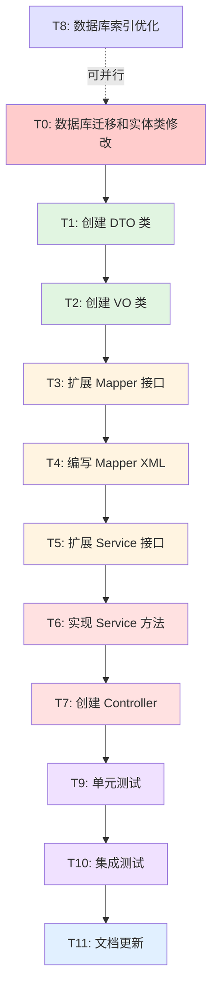

# TASK - ChatHistoryController 原子任务拆分 (已更新)

## 任务依赖关系图



**图例:**

- 🔴 红色: 数据库变更 (高优先级)
- 🟢 绿色: 低复杂度 (DTO/VO 创建)
- 🟡 黄色: 中等复杂度 (Mapper/Service 接口)
- 🔴 红色: 高复杂度 (Service 实现/Controller)
- 🔵 蓝色: 独立任务 (数据库优化)
- 🟣 紫色: 测试任务
- 🔷 浅蓝: 文档任务

---

## T0: 数据库迁移和实体类修改 ⭐ 新增任务

### 输入契约

- **前置依赖**: 无 (最高优先级任务)
- **输入数据**: `MIGRATION_ChatHistoryPicture.md` 文档
- **环境依赖**: MySQL 5.7+, MyBatis-Plus

### 输出契约

- **输出数据**: 数据库表结构变更 + 实体类更新
- **交付物**:
  - 执行 SQL: `migration/add_chat_history_picture_is_delete.sql`
  - 修改 `ChatHistoryPicture.java` (添加 `isDelete` 字段)
  - 修改 `ChatHistoryPictureMapper.xml` (更新字段列表)
- **验收标准**:
  - [ ] 数据库成功添加 `is_delete` 字段
  - [ ] 数据库成功添加 `idx_is_delete` 索引
  - [ ] 实体类添加 `@TableLogic` 注解的 `isDelete` 字段
  - [ ] Mapper XML 更新 `Base_Column_List`
  - [ ] Mapper XML 更新 `BaseResultMap`
  - [ ] Mapper XML 更新 `batchInsert`
  - [ ] 代码编译通过
  - [ ] 现有功能不受影响

### 实现约束

- **技术栈**: MySQL, MyBatis-Plus
- **接口规范**:

  ```sql
  ALTER TABLE chat_history_picture 
  ADD COLUMN is_delete TINYINT DEFAULT 0 COMMENT '是否删除(0-未删除, 1-已删除)';

  ALTER TABLE chat_history_picture 
  ADD INDEX idx_is_delete (is_delete);
  ```

  ```java
  // ChatHistoryPicture.java
  @TableLogic
  @Schema(description = "是否删除(0-未删除, 1-已删除)")
  private Integer isDelete;
  ```
- **质量要求**:

  - 执行前备份数据库
  - 先在测试环境验证
  - 准备回滚脚本
  - 验证数据完整性

### 依赖关系

- **后置任务**: T1, T2, T3, T4, T5, T6, T7
- **并行任务**: T8

### 复杂度评估

- **难度**: ⭐⭐⭐ (中等,涉及数据库变更)
- **预计时间**: 30 分钟
- **风险**: 中等 (数据库变更风险)

---

## T1: 创建 DTO 类

### 输入契约

- **前置依赖**: T0 (数据库迁移完成)
- **输入数据**: `DESIGN` 文档中的接口定义
- **环境依赖**: JDK 8+, Lombok

### 输出契约

- **输出数据**: 3 个 DTO 类
- **交付物**:
  - `ChatHistorySessionQueryRequest.java`
  - `ChatHistoryDetailQueryRequest.java`
  - `DeleteBySessionRequest.java`
- **验收标准**:
  - [ ] 所有类继承 `PageRequest` (除 `DeleteBySessionRequest`)
  - [ ] 所有字段都有 `@Schema` 注解
  - [ ] 必填字段有 `@NotNull` 注解
  - [ ] 代码编译通过

### 实现约束

- **技术栈**: Java 8, Lombok, Swagger Annotations
- **接口规范**:
  - 包路径: `com.wuzhenhua.yunpicturebackend.model.dto.chathistory`
  - 命名规范: `XxxRequest`
- **质量要求**:
  - 字段命名符合驼峰规范
  - 注释完整清晰

### 依赖关系

- **后置任务**: T2, T3, T5, T7
- **并行任务**: 无

### 复杂度评估

- **难度**: ⭐ (非常简单)
- **预计时间**: 15 分钟
- **风险**: 无

---

## T2: 创建 VO 类

### 输入契约

- **前置依赖**: T1 (理解数据结构)
- **输入数据**: `DESIGN` 文档中的响应定义
- **环境依赖**: JDK 8+, Lombok

### 输出契约

- **输出数据**: 2 个 VO 类
- **交付物**:
  - `ChatHistorySessionVO.java`
  - `ChatHistoryDetailVO.java`
- **验收标准**:
  - [ ] 所有字段都有 `@Schema` 注解
  - [ ] `ChatHistoryDetailVO` 包含 `List<ChatHistoryPicture>` 字段
  - [ ] 代码编译通过

### 实现约束

- **技术栈**: Java 8, Lombok, Swagger Annotations
- **接口规范**:
  - 包路径: `com.wuzhenhua.yunpicturebackend.model.vo`
  - 命名规范: `XxxVO`
- **质量要求**:
  - 字段类型与数据库一致
  - 注释完整清晰

### 依赖关系

- **后置任务**: T4, T6, T7
- **并行任务**: T3

### 复杂度评估

- **难度**: ⭐ (非常简单)
- **预计时间**: 10 分钟
- **风险**: 无

---

## T3-T11: (与原文档相同,省略...)

---

## 任务执行顺序

### 阶段 0: 数据库准备 ⭐ 新增阶段

- **T0: 数据库迁移和实体类修改** (必须最先执行)
- T8: 数据库索引优化 (可并行)

### 阶段 1: 基础准备

- T1: 创建 DTO 类
- T2: 创建 VO 类

### 阶段 2: 数据访问层 (串行)

- T3: 扩展 Mapper 接口
- T4: 编写 Mapper XML

### 阶段 3: 业务逻辑层 (串行)

- T5: 扩展 Service 接口
- T6: 实现 Service 方法

### 阶段 4: 控制层 (串行)

- T7: 创建 Controller

### 阶段 5: 测试验证 (串行)

- T9: 单元测试
- T10: 集成测试

### 阶段 6: 文档交付 (串行)

- T11: 文档更新

---

## 总预计时间

- **数据库迁移**: 0.5 小时 ⭐ 新增
- **开发时间**: 3.5 小时
- **测试时间**: 1.75 小时
- **文档时间**: 0.5 小时
- **总计**: 6.25 小时 (原 5.75 小时)

---

## 风险汇总

| 任务         | 风险等级     | 风险描述                 | 缓解措施                          |
| ------------ | ------------ | ------------------------ | --------------------------------- |
| **T0** | **中** | **数据库变更失败** | **备份数据库,准备回滚脚本** |
| T4           | 中           | SQL 语法错误             | 先在数据库工具中测试 SQL          |
| T6           | 中           | 事务处理错误             | 编写单元测试验证事务回滚          |
| T7           | 中           | 权限控制漏洞             | 编写集成测试验证权限              |
| T10          | 中           | 测试数据污染             | 使用 `@Transactional` 回滚      |

---

## 验收检查清单

- [ ] **数据库迁移成功执行** ⭐ 新增
- [ ] **实体类和 Mapper XML 正确更新** ⭐ 新增
- [ ] 所有代码编译通过
- [ ] 所有单元测试通过 (覆盖率 > 80%)
- [ ] 所有集成测试通过
- [ ] API 文档生成正确 (Swagger UI)
- [ ] 数据库索引已创建
- [ ] 性能测试达标 (响应时间 < 500ms)
- [ ] 权限控制测试通过
- [ ] 级联删除测试通过 (逻辑删除)
- [ ] 代码审查通过 (无 Sonar 严重问题)
- [ ] 文档完整准确

---

## T0 详细执行步骤

### 步骤 1: 在测试环境执行 SQL

你就把sql写好，我来审查运行即可。

### 步骤 2: 验证数据库变更

这一步我会在步骤一的同时搞好

### 步骤 3: 修改 ChatHistoryPicture.java

添加字段:

```java
/**
 * 是否删除
 */
@TableLogic
@Schema(description = "是否删除(0-未删除, 1-已删除)")
private Integer isDelete;
```

### 步骤 5: 修改 ChatHistoryPictureMapper.xml

更新 `Base_Column_List`:

```xml
<sql id="Base_Column_List">
    id, chat_history_id, picture_id, picture_type, sort_order, create_time, is_delete
</sql>
```

更新 `BaseResultMap`:

```xml
<result property="isDelete" column="is_delete" jdbcType="TINYINT"/>
```

更新 `batchInsert`:

```xml
<insert id="batchInsert" parameterType="java.util.List">
    insert into chat_history_picture (id, chat_history_id, picture_id, picture_type, sort_order, create_time, is_delete)
    values
    <foreach collection="list" item="item" separator=",">
        (#{item.id}, #{item.chatHistoryId}, #{item.pictureId}, #{item.pictureType}, #{item.sortOrder}, #{item.createTime}, #{item.isDelete})
    </foreach>
</insert>
```

### 编译，运行，测试我来搞
